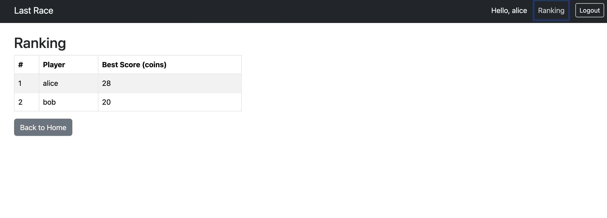
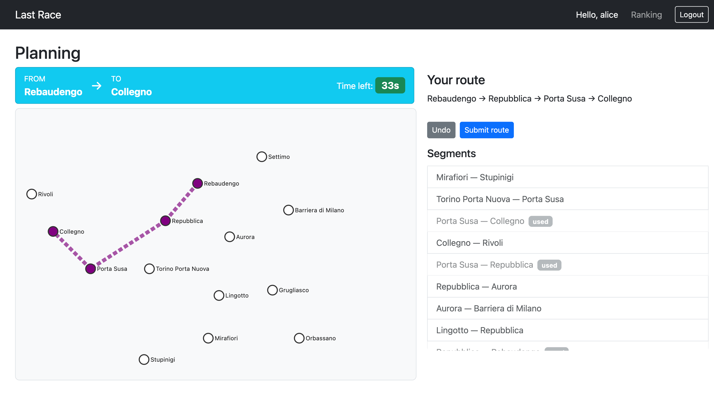

# Exam #1: "Last Race"
## Student: s344202 Gurov Dmitrii

# Server-side

## API 

- `GET /api/network` — Returns the full network: lines, stations, and segments (pairs of adjacent stations per line). No authentication required.
- `GET /api/game/start` — Returns a randomly assigned start and destination station (minimum distance of 3 segments). Requires authentication.
- `POST /api/game/submit` — Body: `{ route: [stationId, ...], startId, destId }`. Validates the route, executes the journey (applies random events per segment), saves the game, and returns `{ valid, score, steps }`. Requires authentication.
- `GET /api/ranking` — Returns the best score per user, sorted descending. Requires authentication.
- `POST /api/sessions` — Body: `{ username, password }`. Logs in the user and creates a session. Returns `{ id, username }`.
- `GET /api/sessions/current` — Returns the currently logged-in user, or 401 if not authenticated.
- `DELETE /api/sessions/current` — Logs out the current user and destroys the session.

## Database Tables

- Table `lines` — Contains the metro lines (id, name, color).
- Table `stations` — Contains all stations (id, name).
- Table `line_stations` — Maps stations to lines with their order (line_id, station_id, position). Used to compute segments and interchange stations.
- Table `events` — Contains random events with a description and coin effect from -4 to +4.
- Table `users` — Contains registered users with hashed and salted passwords (id, username, password, salt).
- Table `games` — Records each completed game: user, start/destination stations, final score, and timestamp.

# Client-side

## React Client Application Routes

- Route `/`: Home page with game instructions. Anonymous users see instructions only; logged-in users see a Play button.
- Route `/login`: Login form for registered users.
- Route `/game`: The game itself, with four sequential phases: Setup, Planning, Execution, Result. Accessible only to logged-in users.
- Route `/ranking`: General ranking table showing the best score of each registered user. Accessible only to logged-in users.

## Main React Components

- `App` (in `App.jsx`): Root component. Handles routing, stores the logged-in user in state, and renders the navbar.
- `GamePage` (in `pages/GamePage.jsx`): Manages all four game phases (setup, planning, execution, result) using a single `phase` state variable.
- `NetworkMap` (in `components/NetworkMap.jsx`): Renders the metro network as an SVG. Accepts `showLines` prop to toggle line visibility, and `highlightRoute` to draw the player's route.
- `LoginPage` (in `pages/LoginPage.jsx`): Login form with controlled inputs.
- `RankingPage` (in `pages/RankingPage.jsx`): Fetches and displays the ranking table.
- `HomePage` (in `pages/HomePage.jsx`): Displays game instructions and a Play or Login button depending on auth state.

# Overall

## Screenshot: Ranking Page

## Screenshot: Game / Planning Phase

## Users Credentials

- `alice` / `alice123`
- `bob` / `bob456`
- `carol` / `carol789`

## Use of AI Tools

Claude (Anthropic) was used during the development of this project for two purposes:
1. **Generating test data**: station and line names for the fictional Turin metro network, as well as seed user data, were suggested by the AI and then manually reviewed and adapted.
2. **Code refactoring**: some components were restructured with AI assistance to improve clarity. All generated code was reviewed, tested, and adapted.
